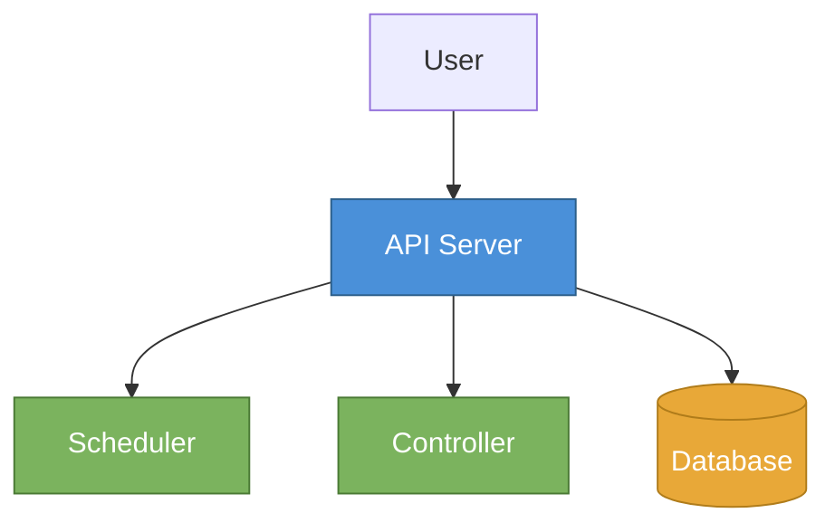

# Article Writer for sadensmol.com

## Workflow

### Step 0: Locate the blog directory

Resolve the Hugo blog directory before anything else — **never hardcode a local path**:

1. **Check the current directory** (and walk up parent dirs): treat it as the blog if it contains a Hugo config (`hugo.toml` / `hugo.yaml` / `config.toml` / `config.yaml`) **and** a `content/posts/` directory.
2. **If found**, use it as the blog directory.
3. **If not found**, ask the user which directory to use — present it as a selectable dropdown question (e.g. via AskUserQuestion) listing any detected candidates plus an "enter a path" option. Do **not** guess or fall back to a hardcoded location.

Use the resolved path as the blog directory for all file operations below (`content/posts/`, `static/images/posts/`).

### Step 1: Determine article source

Ask the user:

> Would you like to write an article from a link, or from scratch?
>
> - **From a link** — provide a URL and I'll read it, then rewrite the content in your voice
> - **From scratch** — describe the topic and I'll write an original article

### Step 2: If from a link — detect link type and fetch content

**If the link is a GitHub/git repository:**
1. Use `gh` CLI or the `github` skill to retrieve repo info: name, description, README, relevant code/docs
2. Check if the repo belongs to the user (sadensmol) — look for `sadensmol` in the URL
3. **If it's a `learning_system-design` repo (or similar `learning_*` pattern):**
   - This is a learning series — the article title must follow the format: `Learning System Design #<N>: <Topic>`
   - To determine `<N>`: scan existing posts in `content/posts/` for files matching `*learning-system-design*` and count them — the new article is the next number
   - The slug should be: `learning-system-design-<N>-topic-name` (e.g. `learning-system-design-1-how-http-works`)
   - Extract the specific topic/theme from the repo content (README, folder structure, code)
4. If it's any other git repo — use the repo description, README, and code to understand the topic, then proceed normally

**If the link is a regular article/blog/docs URL:**
1. Use the `agent-browser` skill or `WebFetch` tool to read the source URL
2. Extract the core topic, key points, code examples, and technical insights

In all cases:
- Do NOT copy the original — rewrite entirely in sadensmol's voice using your own experience and perspective
- Keep the original link to include in the article as a reference (see Step 7)

### Step 3: Gather article details

Ask the user for:
- **Title** (suggest 2-3 options based on the topic — or auto-generate if it's a learning series)
- **Tags** (suggest relevant ones from existing tags, see [blog-setup.md](references/blog-setup.md))
- **Draft or publish?** (draft = true/false)

### Step 4: Read writing style reference

Read [references/writing-style.md](references/writing-style.md) for voice, tone, structure, and formatting rules. Match the style of existing articles on sadensmol.com.

Key style points:
- First person, conversational, opinionated
- Short paragraphs, code examples for every technical claim
- Problem → Solution structure
- No AI-sounding phrases
- End with Summary/Conclusion, optionally PS for reader engagement

### Step 5: Read blog setup reference

Read [references/blog-setup.md](references/blog-setup.md) for frontmatter format, file naming, and image handling.

### Step 6: Create the article file

1. Create the file at `content/posts/YYYY-MM-DD-slug.md` in the blog directory (resolved in Step 0)
2. Use TOML frontmatter with `+++` delimiters
3. Include: title, slug, date (today), draft status, description (80-150 chars), tags

### Step 7: Write the article

Write the full article following the style guide. Key rules:
- Write as sadensmol — first person, from personal experience
- Keep it practical and easy to understand
- Include code examples where relevant (with language tags)
- Use `##` for sections, `###` for subsections
- Keep articles 150-400 lines (target ~5 min read / 1000-1500 words)
- End with a short Summary/Conclusion

**Hero image:** Every article should have a hero image — a real photograph (not a generated graphic or diagram). **ALWAYS use the `agent-browser` skill** to search Google Images for a visually striking photo that metaphorically represents the article's topic (e.g. dominos for chain reactions, network cables for distributed systems). Download it via the browser and save as `/static/images/posts/<slug>-hero.jpg`. Place the hero image **after the opening paragraph**, not right after the title. Do NOT use WebSearch, WebFetch, or curl for hero image search/download — always use `agent-browser`.

**Including diagrams and images:** Every article MUST also include at least 1-2 diagrams to illustrate key concepts. Use these approaches:

1. **Mermaid diagrams** (preferred for architecture, flows, sequences, comparisons, tables) — generate a Mermaid `.mmd` file in `/tmp/`, render to PNG using the globally installed `mmdc` CLI, save to `/static/images/posts/`, and reference in the article
2. **Sequence diagrams** — use Mermaid sequence diagrams for request/response flows

**NEVER use ASCII-art tables, boxes, or diagrams in code blocks** (`┌──┬──┐`, `│ │`, `└──┴──┘`, etc.). They look awful in the rendered blog — rows misalign, borders break, monospace rendering varies across devices. If you want to show a table layout, a row/column comparison, or any "boxy" structure — ALWAYS render it as a Mermaid diagram (JPG or PNG) instead. This includes:
- Row-store vs column-store comparisons
- "Before / After" diagrams
- Data layout illustrations
- Any table-like schematic
- Protocol stack layers
- Memory/disk layouts

The only acceptable ASCII in code blocks is actual code, real CLI output, or short directory trees (where monospace alignment naturally works).

**Mermaid rendering command:**
```bash
mmdc -i /tmp/diagram.mmd -o /path/to/static/images/posts/slug-descriptor.png -b transparent -t neutral -s 2
```

**IMPORTANT rendering notes:**
- Use `mmdc` directly (globally installed via `npm install -g @mermaid-js/mermaid-cli`). Do NOT use `npx -y @mermaid-js/mermaid-cli mmdc` — it has argument parsing bugs
- If `mmdc` is not found, install it first: `npm install -g @mermaid-js/mermaid-cli`
- Always use `-b transparent` — the blog CSS auto-inverts only PNG images on dark theme via `filter: invert(0.88) hue-rotate(180deg)` on `img[src$=".png"]`, so transparent backgrounds work on both themes. Hero photos (JPG) are not affected
- Always use `-s 2` for 2x scale — default scale produces tiny, unreadable diagrams on the blog
- Use `-t neutral` for a clean look
- Write `.mmd` files to `/tmp/` to avoid cluttering the repo

**Mermaid layout rules (CRITICAL — follow these to avoid unreadable diagrams):**
- **NEVER use nested subgraphs** — they produce scattered, unbalanced layouts that Mermaid's layout engine cannot handle well
- **Use flat flowcharts** with color-coded `style` directives to visually group related nodes instead of subgraphs
- **Color-code by role** — e.g. blue for central components, green for internal services, orange for storage, purple for workers, gray for leaf nodes
- **Keep labels single-line** — NEVER use `\n` in node labels (renders as literal text). Use short, clear labels instead
- **Use `stateDiagram-v2`** for process/lifecycle diagrams instead of flowcharts with diamond decision nodes — state diagrams produce cleaner cycle visualizations
- **Colored diagrams and dark mode:** colored PNGs will look wrong with dark mode CSS inversion. Two options: (1) save as `.jpg` instead of `.png` to skip inversion and keep colors, or (2) use monochrome/gray for diagrams that must be `.png`. Ask the user which they prefer
- Always verify rendered diagrams by reading the PNG before proceeding — if it looks bad, redo it

Example of a clean colored flat flowchart:


Diagram guidelines:
- Save generated images to `/static/images/posts/<slug>-<descriptor>.png` (or `.jpg` for colored diagrams)
- Reference in article as ``
- Place diagrams near the text they illustrate, not all at the top
- Alt text should describe what the diagram shows
- Use diagrams to explain: architecture, data flow, request lifecycle, comparison tables, decision trees
- Always verify rendered PNGs/JPGs by reading them before proceeding

**Including source links:** If the article is based on a source URL, include the original link naturally in the article body — as "more information", "source", or "for a more detailed look". Place it as a bare URL on its own line where it fits contextually.

For git repositories, link to the repo itself. For articles/docs, link to the original page. Example:

```markdown
I created a demo for this article, check it out:

https://github.com/sadensmol/article-go-gems-1

If you want to dig deeper into this topic, here is a great resource:

https://example.com/original-source
```

Resource links should also appear as bare URLs on their own lines throughout the article where relevant.

### Step 8: Generate social media posts

After writing the article, generate ready-to-post text for LinkedIn and X.com (Twitter).

**LinkedIn post:**
- 3-5 short paragraphs, hook-driven opening line (question or bold statement)
- Include 1-2 key takeaways or insights from the article
- End with a call-to-action engaging the reader (question, opinion request) — do NOT include link placeholders, the link is added manually later
- Add 3-5 relevant hashtags at the bottom (e.g. #golang #systemdesign #backend #softwaredevelopment #programming)
- Tone: professional but conversational, matching sadensmol's voice
- **HARD character limit: 900 characters total including hashtags and newlines.** The poster tool rejects anything longer — this is not a soft guideline, it's been verified in practice. Target ~800 chars to leave headroom. Count characters with `wc -c` before presenting the post and trim if needed.
- LinkedIn also truncates the visible preview at ~210 chars with a "see more" link, so the hook (first 1-2 sentences) must stand on its own and make readers want to expand.
- Prefer fewer bullets with tighter wording over a long list. Cut "background" phrases like "I spent a week on this" or "here are the key takeaways" — go straight to the substance. Em-dashes and short bullet fragments beat full sentences.

**X.com (Twitter) post:**
- Single tweet, under 280 chars
- Attention-grabbing hook about the article topic
- Use line breaks for readability
- End with 2-3 relevant hashtags
- Do NOT include a link placeholder — the link is added automatically later
- Tone: punchy, direct, slightly provocative

**Threads.com post:**
- 2-3 short paragraphs, casual and conversational
- Hook-driven opening line
- Do NOT include a link placeholder — the link is added manually later
- End with 2-3 relevant hashtags
- Keep under 500 characters for optimal engagement
- Tone: relaxed, like talking to a friend, matching sadensmol's voice

Present all three posts in a clearly labeled section after the article review, formatted as copyable text blocks.

### Step 9: Review and refine

Present the article to the user for review. Offer to:
- Adjust tone or length
- Add/remove sections
- Change title or tags
- Add code examples
- Modify social media posts (LinkedIn/X.com/Threads)

## Important Rules

- NEVER copy source content verbatim — always rewrite from scratch in sadensmol's voice
- Read at least 2 existing articles before writing to calibrate the voice
- Use existing tags when possible, only create new tags if truly needed
- Target ~5 minute read time (1000-1500 words, 150-400 lines) — cover the topic thoroughly, not just a surface skim
- File naming must follow `YYYY-MM-DD-slug.md` pattern
- Description should be a single concise sentence capturing the article's value
- Every article must include at least 1-2 diagrams/images to illustrate key concepts
- Generate diagrams using `mmdc` (globally installed) with `-b transparent -t neutral` — blog CSS auto-inverts on dark theme
- **NEVER use ASCII-art tables or box diagrams** (`┌──┐`, `│ │`, `└──┘`) — they render badly. Use Mermaid diagrams for any table/box/layout schematic instead
- Always generate LinkedIn, X.com, and Threads posts after writing the article
- Always include source/reference links when article is based on external content
- For `learning_*` repos (e.g. `learning_system-design`), always use the series title format: `Learning System Design #<N>: <Topic>` — auto-detect the part number from existing posts
