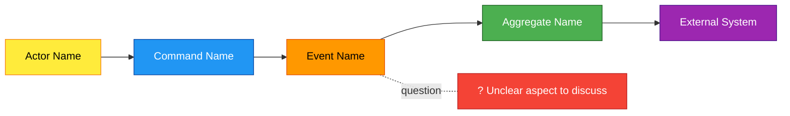
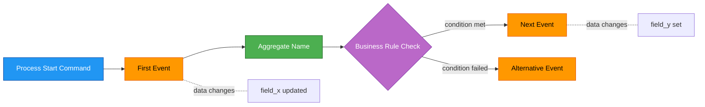
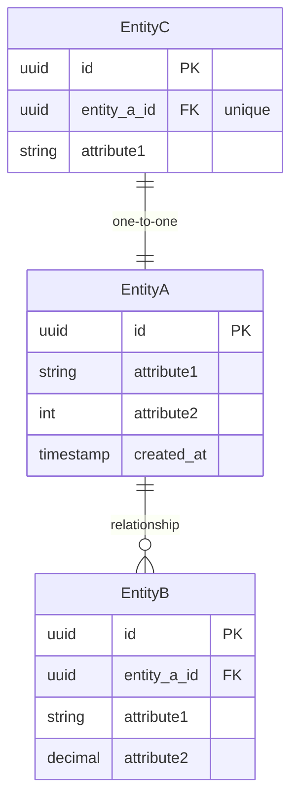
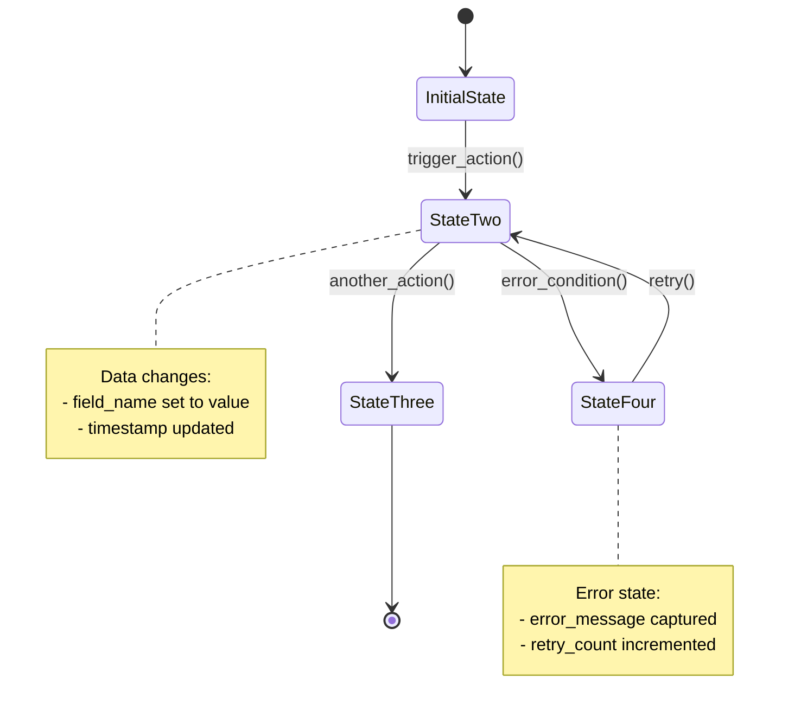
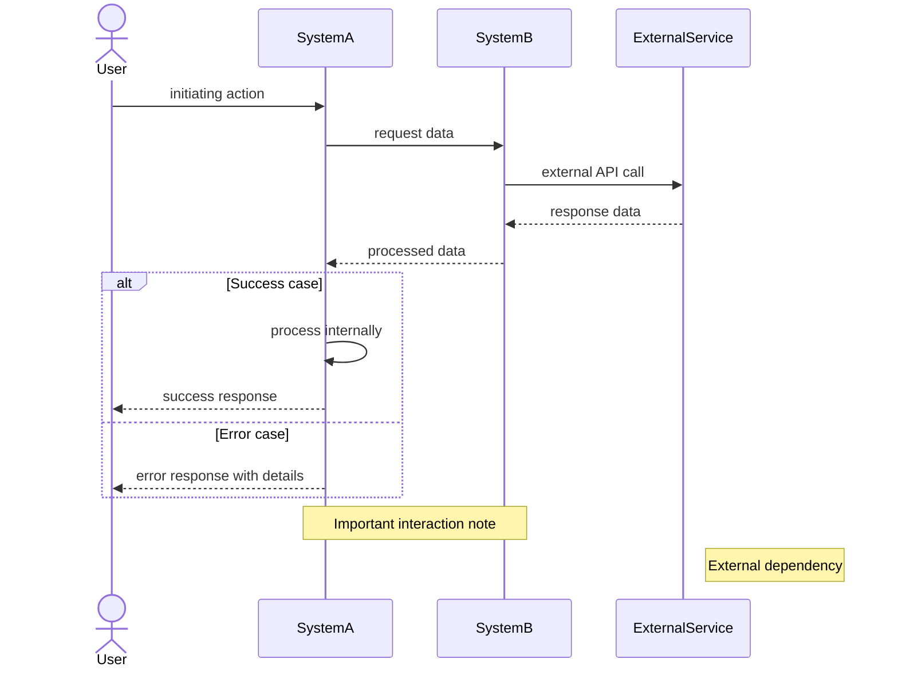

# Mermaid Diagram Templates

## EventStorming Big Picture Template



## Process EventStorming Template



## Entity-Relationship Diagram Template



## State Chart Template



## Sequence Diagram Template



## Requirements Template

```markdown
# Requirements: {Project Name}

## Business Goals

{What problem does this system solve? What value does it provide?}

## Key Actors

| Actor | Description | Primary Goals |
|-------|-------------|---------------|
| {Actor 1} | {Who they are} | {What they want to achieve} |

## Constraints

### Technical
- {Technical constraints}

### Business
- {Budget, timeline, compliance requirements}

### Scale
- {Expected users, transactions, data volume}

## Success Criteria

- {How do we measure success?}

## External Systems

| System | Purpose | Integration Type |
|--------|---------|-----------------|
| {System 1} | {What it does} | {API, webhook, batch, etc.} |

## Open Questions / Hotspots

- {Unclear requirements}
- {Risk areas to explore}
```

## Plan Document Template

```markdown
# System Design: {Project Name}

> {Brief 1-2 sentence description}

## Core Documents

- [requirements.md](../requirements.md) - Actors, constraints, scale, success criteria
- [big-picture.mmd](../big-picture.mmd) - EventStorming big picture diagram

## Process Models

### {Process Name}

\`\`\`mermaid
{COPY ENTIRE CONTENT FROM ../process-{name}.mmd HERE}
\`\`\`

## Data Model

\`\`\`mermaid
{COPY ENTIRE CONTENT FROM ../erd.mmd HERE}
\`\`\`

## State Models

### {Entity} Lifecycle

\`\`\`mermaid
{COPY ENTIRE CONTENT FROM ../state-{entity}.mmd HERE}
\`\`\`

## Critical Flows

### {Flow} Flow

\`\`\`mermaid
{COPY ENTIRE CONTENT FROM ../sequence-{flow}.mmd HERE}
\`\`\`

## Technical Deep Dives

For complex topics, see supporting documentation:

- [Caching Strategy](../caching.md) - {if caching is used}
- [Rate Limiting](../rate-limiting.md) - {if rate limiting is used}
- [Message Queues](../message-queues.md) - {if async messaging is used}

## Hotspots & Open Questions

{List of unclear areas, risks, or decisions to be made}

## Next Steps

{Implementation order, dependencies, or next phase}
```

## Supporting Documentation Template

```markdown
# {Topic Name}

> Focused documentation for the chosen approach - not a comparison of alternatives.

## What It Is

{1-2 paragraph explanation of the concept}

## How It Works

{Explain the mechanism, include diagram if helpful}

\`\`\`mermaid
{Optional: Diagram showing how this works in context}
\`\`\`

## Why This Approach

{Brief rationale for why this was chosen over alternatives - keep concise}

## Key Configuration

{Important settings, thresholds, or parameters to consider}

## Related Patterns

- {Link to related docs if applicable}
```
